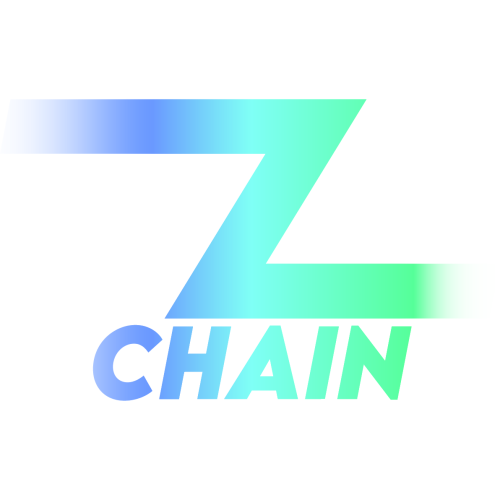

 

  

  <h3 align="center">ZChain Concept Blockchain</h3>

  

    Concept blockchain with basic consensus functionality written in Go
     
    <a href="https://github.com/zaidallam/ZChainConceptBlockchain"><strong>Explore the docs »</strong></a>
     
  

## About The Project

This is a very simple concept blockchain written in golang. The blockchain does not have its own currency, and instead simply stores arbitrary data, which can be virtually anything. Each running instance of the project acts as a ZChain node, and different nodes are simulated by running them on various localhost ports on your local machine.
Each node keeps a copy of the blockchain. Every node has the ability to propose a new block, and it waits on consensus between 80% or more of it's peer nodes before committing the proposed block to it's local record of the blockchain. Consensus is simple and is based on 80% or more of the peer nodes agreeing to add the block to their own local copy of the blockchain. In this fashion, all nodes' copies of the blockchain stay synchronized with eachother.
Nodes discover eachother by passing along lists of discovered nodes between one-another as they make requests and propose new blocks. Over time, this means that every node on the network will become aware of all the others.
The project uses a wide array of golang features and libraries, relative to it's size. No other major technologies are used.
To get started, please read below and follow the "Getting Started" directions

(<a href="#top">back to top</a>)

### Built With

* [Go](https://go.dev/)
* [go-spew](github.com/davecgh/go-spew/spew)
* [Gorilla Toolkit's gorilla/mux](github.com/gorilla/mux)
* [GoDotEnv](github.com/joho/godotenv)

(<a href="#top">back to top</a>)

## Getting Started

Getting started is simple. Begin by downloading the repo and running `go get` from the terminal. Next, create a `.env` file in root directory of the project. Populate this file two variables: `PORT` and `DISCOVERY_NODE_ADDRESS`. Set the `PORT` variable to whatever port you want the first instance of the blockchain to run on. `DISCOVERY_NODE_ADDRESS` is used for initializing new nodes into an already-running blockchain. Thus, for the initial node, this should be left blank. For all subsequent nodes, however, you'll want to put the localhost http address of the initial node that created the genesis block for your blockchain (This could be `DISCOVERY_NODE_ADDRESS=http://localhost:5000`, for instance). If you try to run two nodes on the same port, the project will not work correctly.
Once you've done that initial setup, starting a new node is as simple as running `go run ZChain.go` from the terminal. From there, you can create as many new nodes as you like, and they will all stay synchronized with one another as long as a `DISCOVERY_NODE_ADDRESS` in the `.env` file is provided for all new nodes.
To add a new block to the blockchain, simply send a POST request to the `/` route of any synchronized node. The JSON body of your request should be formatted as such: `{ "Data":"Sample Data" }`.
To see a node's current copy of the blockchain, send a GET request to the `/` route of your desired node.

## Prerequisites

This project requires you to have the Go programming language installed and configured on your system.

(<a href="#top">back to top</a>)

## License

Distributed under the MIT License. See `LICENSE` for more information.

(<a href="#top">back to top</a>)

## Contact

See the developer's portfolio, zaidallam.com, for contact info.

(<a href="#top">back to top</a>)
